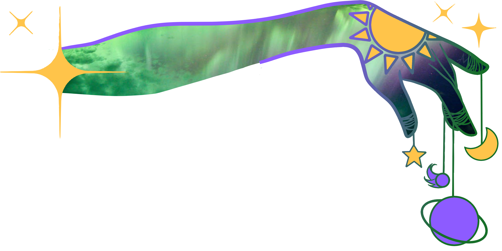

#  _Cosmic Cue_ - A Fortune Telling App

Cosmic Cue is an app designed to bring positivity and inspiration into your life. With Cosmic Cue, you can receive daily fortunes and signs from the universe to help guide you on your path.

## Features

- Daily fortunes to provide inspiration and guidance
- Ability to create fortunes that others may receive
- Daily signs to know what to look for
- Ability to create a sign that others may receive
- Positivity board to share your manifestations and goals with the Cosmic Cue community
---
## Getting Started 
 ## **[ Click here to use Cosmic Cue](https://main--cosmic-cue.netlify.app/)** 
 Once you have navigated to the app, create an account and start exploring the features. You can receive a new fortune every day, or create custom fortunes for others to receive. 

**[Click to view Planning Materials](https://trello.com/b/LMJeooEb/cosmic-cue-app)** 

 **[Back-End Repo](https://github.com/CCMatson/cosmic-cue-back-end)**

# Technologies Used

<table>
    <tbody>
        <tr>
            <td>
            
            </a></td>
            <td>
            
            </a></td>
            <td>
            
            </a></td>
              <td>
            
            </a></td>
              <td>
            
            </a></td>
             <td>
            
            </a></td>
        </tr>
    </tbody>
</table>

## Next Steps 🧊 

---
- [X]  Let non users get fortunes

- [ ]   Mobile Responsive

- [ ]  Implement User roles

- [ ]  Likes on Postivity Posts

- [ ]  Ability to save fortunes on profile

- [ ]  Limit to one sign per week

- [ ]  Save sign to profile

- [ ]  Ability to customize profile page (add bio etc)

### Contributors:
---
[ Catherine Matson](https://github.com/CCMatson)  
[ Ayala Murúch ](https://github.com/ayamur)  
[ Kendra Lacey ](https://github.com/kendra-lacey)

### Credits/Attribution:
---
<a href="https://www.flaticon.com/free-icons/love-and-romance" title="love and romance icons">Love and romance icons created by Ifanicon - Flaticon</a>  
<a href="https://www.linkedin.com/in/ayalamuruch/" title="Celstial Icons">Celestial Icons and art by Aya! </a>

**[ Click here to use Cosmic Cue](https://main--cosmic-cue.netlify.app/)**
